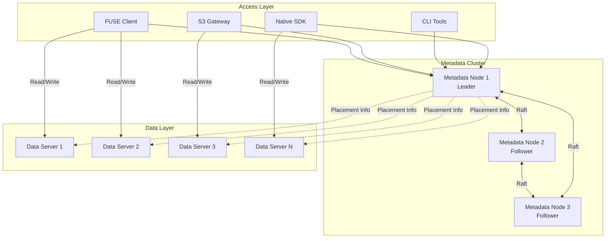
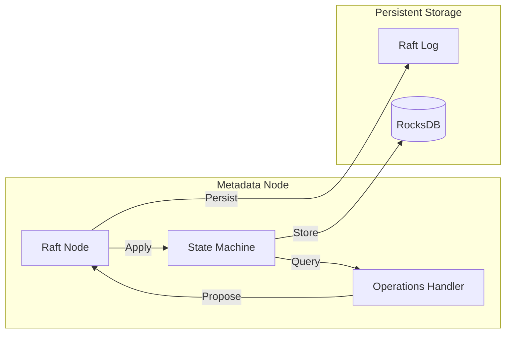
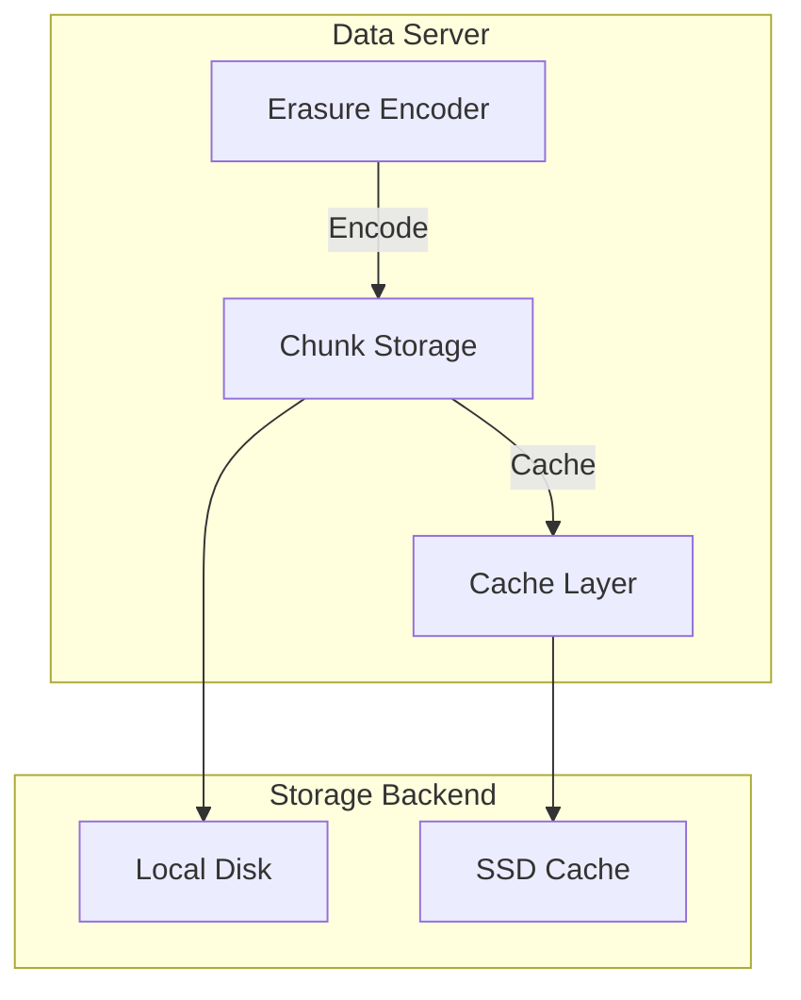
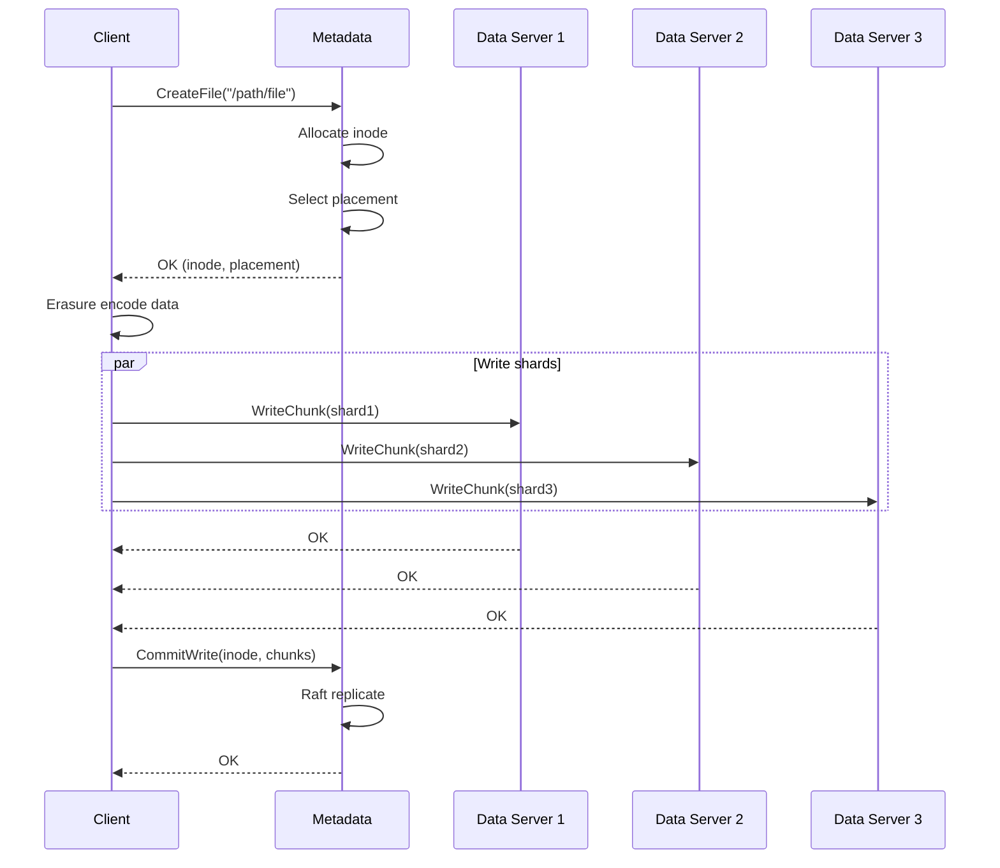
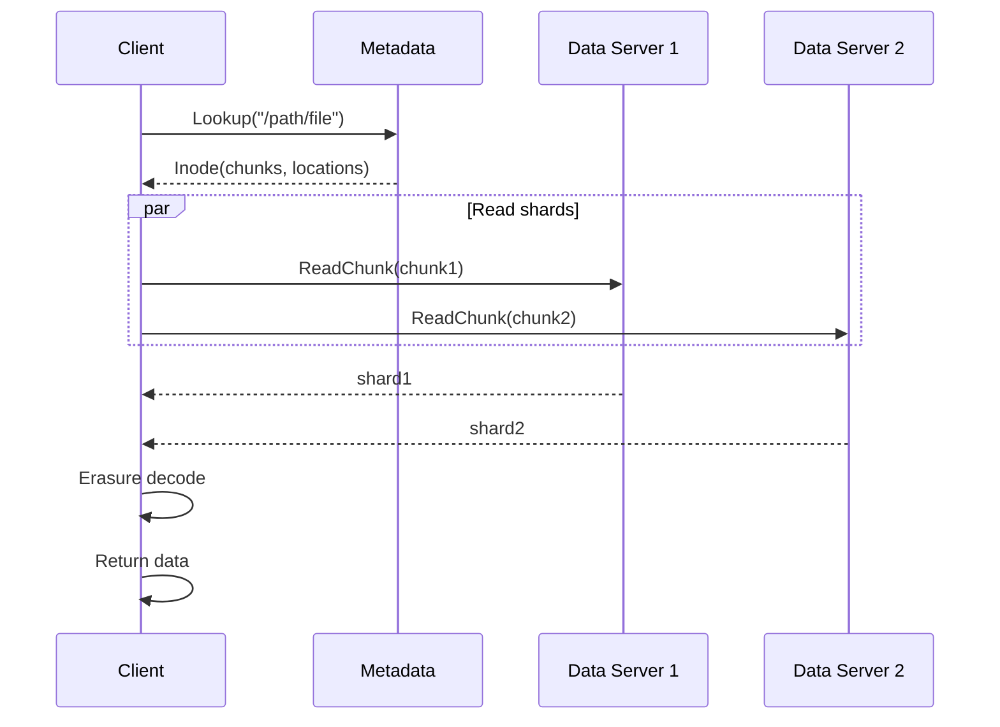
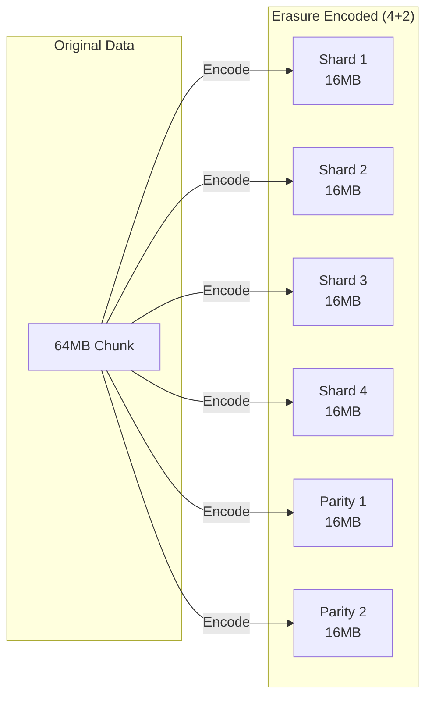
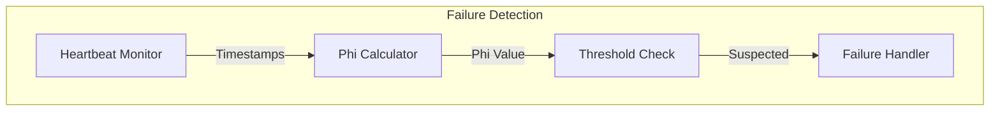
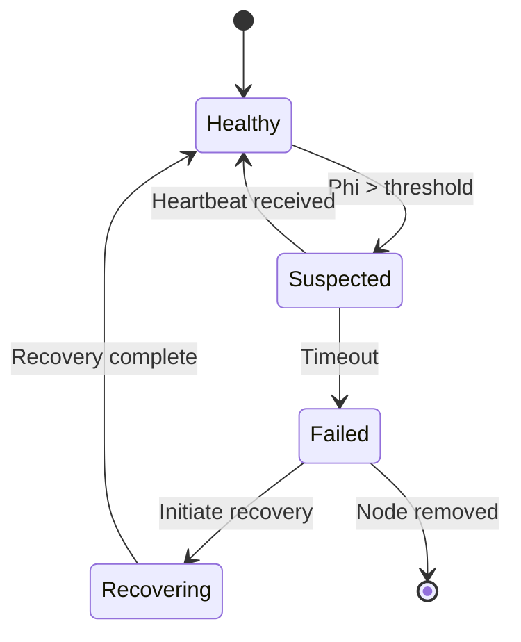
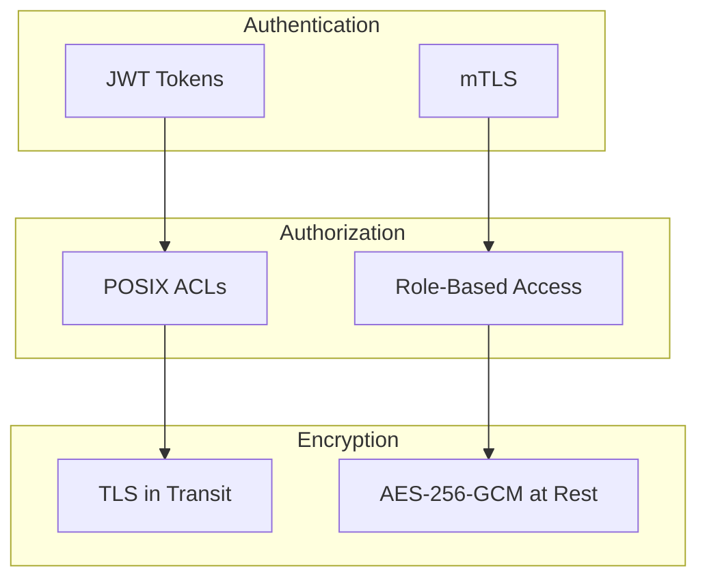

# Strata Architecture Overview

This document provides a comprehensive overview of Strata's distributed file system architecture.

## System Architecture

Strata is designed as a distributed file system with three main layers: Access, Metadata, and Data.

## Component Overview

### Access Layer

The access layer provides multiple interfaces for clients to interact with Strata:

| Component | Protocol | Use Case |
|-----------|----------|----------|
| **FUSE Client** | POSIX | Mount as local filesystem |
| **S3 Gateway** | HTTP/S3 | Cloud-native applications |
| **CLI Tools** | gRPC | Administration and scripting |
| **Native SDK** | gRPC | Application integration |

### Metadata Cluster

The metadata cluster manages the file system namespace and coordinates data placement.

**Key responsibilities:**
- File and directory metadata (inodes, directories)
- Namespace operations (create, delete, rename)
- Chunk placement tracking
- Lease management
- Quota enforcement

### Data Layer

Data servers store the actual file content as chunks with erasure coding.

**Key responsibilities:**
- Chunk storage and retrieval
- Erasure encoding/decoding
- Caching hot data
- Integrity verification (checksums)
- Background scrubbing

## Data Flow

### Write Path

### Read Path

## Erasure Coding

Strata uses Reed-Solomon erasure coding for data durability with configurable data and parity shards.

### Configuration Presets

| Preset | Data | Parity | Overhead | Fault Tolerance |
|--------|------|--------|----------|-----------------|
| Small Cluster | 2 | 1 | 1.5x | 1 node |
| Default | 4 | 2 | 1.5x | 2 nodes |
| Large Cluster | 8 | 4 | 1.5x | 4 nodes |
| Cost Optimized | 10 | 4 | 1.4x | 4 nodes |

## Cluster Management

### Failure Detection

Strata uses the Phi Accrual failure detector for accurate node health monitoring:

### Self-Healing

When failures are detected, Strata automatically recovers:

**Recovery process:**
1. Detect failed node
2. Identify under-replicated chunks
3. Read available shards from healthy nodes
4. Reconstruct missing shards
5. Place reconstructed shards on healthy nodes
6. Update metadata

## Node Roles

Strata supports flexible node deployment:

| Role | Metadata | Data | Use Case |
|------|----------|------|----------|
| **Combined** | Yes | Yes | Small deployments |
| **Metadata** | Yes | No | Dedicated namespace |
| **Data** | No | Yes | Storage scaling |

## Network Ports

| Port | Service | Protocol |
|------|---------|----------|
| 9000 | Metadata/Raft | gRPC |
| 9001 | Data Server | gRPC |
| 9002 | S3 Gateway | HTTP |
| 9090 | Metrics | HTTP/Prometheus |

## Security Model

## See Also

- [Raft Consensus](raft.md) - Deep dive into Raft implementation
- [Data Storage](data-storage.md) - Chunk storage details
- [Cluster Management](cluster.md) - Node management and rebalancing
