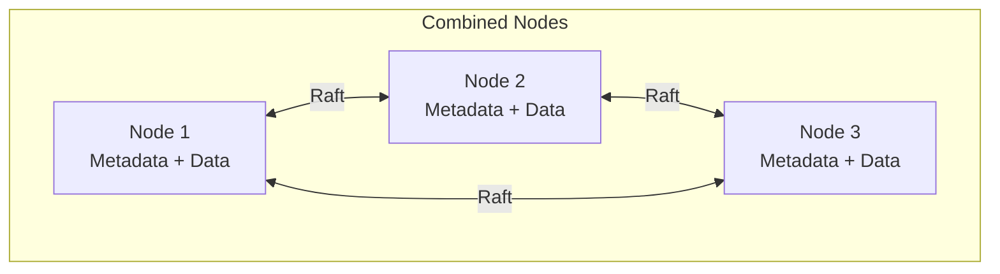
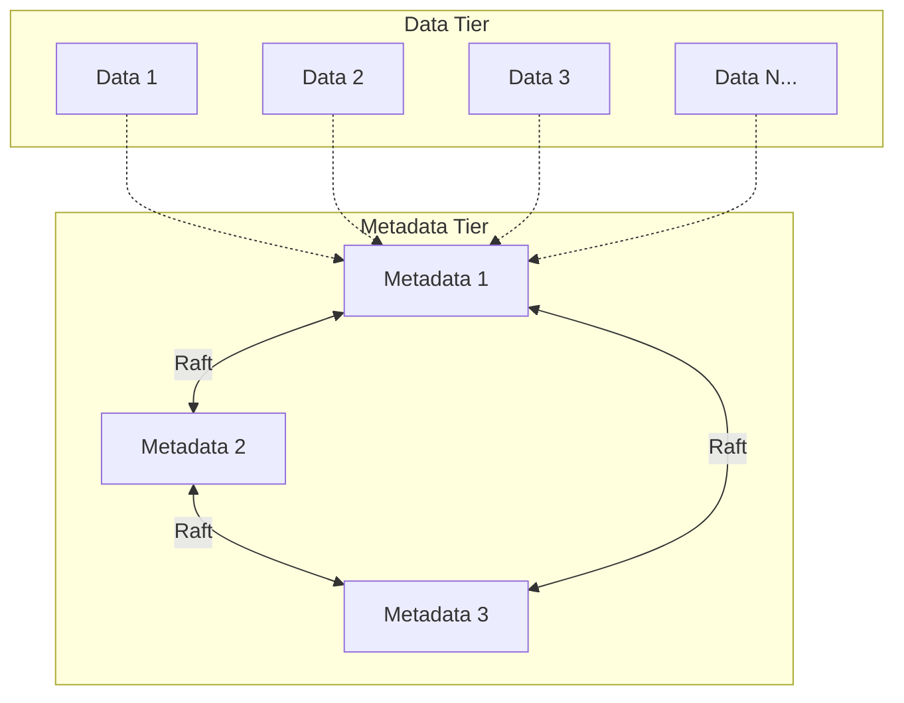

# Deployment Guide

This guide covers deploying Strata in production environments.

## Prerequisites

- **Operating System**: Linux (recommended), macOS for development
- **Rust**: 1.70+ (for building from source)
- **Storage**: SSD recommended for metadata, HDD acceptable for data
- **Network**: Low-latency connections between metadata nodes (< 5ms RTT)
- **Memory**: Minimum 4GB RAM per node, 8GB+ recommended

## Deployment Topologies

### Single Node (Development)

For development and testing:

```bash
# Start a combined node
cargo run --release -- server --node-id 1
```

### Small Cluster (3-5 Nodes)

Recommended for small deployments with combined nodes:



### Production Cluster (10+ Nodes)

Separate metadata and data roles for scale:



## Configuration

### Node Configuration

Create `/etc/strata/config.toml`:

```toml
[node]
id = 1
name = "strata-node-1"
role = "combined"  # or "metadata" or "data"

[metadata]
bind_addr = "0.0.0.0:9000"
raft_peers = [
    "strata-node-2:9000",
    "strata-node-3:9000"
]
election_timeout_min = "150ms"
election_timeout_max = "300ms"
heartbeat_interval = "50ms"

[data]
bind_addr = "0.0.0.0:9001"
chunk_size = 67108864  # 64MB
cache_size = 1073741824  # 1GB

[s3]
enabled = true
bind_addr = "0.0.0.0:9002"
region = "us-east-1"

[network]
connect_timeout = "5s"
request_timeout = "30s"
max_connections = 1000

[storage]
data_dir = "/var/lib/strata/data"
metadata_dir = "/var/lib/strata/metadata"

[storage.erasure_config]
data_shards = 4
parity_shards = 2

[observability]
metrics_enabled = true
metrics_addr = "0.0.0.0:9090"
log_level = "info"
json_logs = false
```

### Environment Variables

Configuration can also be set via environment variables:

```bash
export STRATA_NODE_ID=1
export STRATA_CONFIG=/etc/strata/config.toml
export STRATA_LOG_LEVEL=info
export STRATA_DATA_DIR=/var/lib/strata/data
export STRATA_METADATA_DIR=/var/lib/strata/metadata
```

## Systemd Service

Create `/etc/systemd/system/strata.service`:

```ini
[Unit]
Description=Strata Distributed File System
After=network-online.target
Wants=network-online.target

[Service]
Type=simple
User=strata
Group=strata
ExecStart=/usr/local/bin/strata-server --config /etc/strata/config.toml
Restart=on-failure
RestartSec=5
LimitNOFILE=65536

# Security hardening
NoNewPrivileges=yes
ProtectSystem=strict
ProtectHome=yes
ReadWritePaths=/var/lib/strata /var/log/strata

[Install]
WantedBy=multi-user.target
```

Enable and start:

```bash
sudo systemctl daemon-reload
sudo systemctl enable strata
sudo systemctl start strata
```

## Kubernetes Deployment

### Using the Operator

Deploy the Strata Kubernetes operator:

```bash
# Install the operator
kubectl apply -f https://raw.githubusercontent.com/strata-storage/strata/main/operator/deploy/operator.yaml

# Create a StrataCluster resource
kubectl apply -f - <<EOF
apiVersion: strata.io/v1alpha1
kind: StrataCluster
metadata:
  name: my-cluster
spec:
  metadataNodes: 3
  dataNodes: 5
  storage:
    erasureConfig:
      dataShards: 4
      parityShards: 2
  resources:
    metadata:
      requests:
        memory: "4Gi"
        cpu: "2"
    data:
      requests:
        memory: "8Gi"
        cpu: "4"
EOF
```

### Manual StatefulSet

For manual deployment, use StatefulSets for stable network identities:

```yaml
apiVersion: apps/v1
kind: StatefulSet
metadata:
  name: strata-metadata
spec:
  serviceName: strata-metadata
  replicas: 3
  selector:
    matchLabels:
      app: strata-metadata
  template:
    metadata:
      labels:
        app: strata-metadata
    spec:
      containers:
      - name: strata
        image: strata/strata:latest
        args:
        - server
        - --role=metadata
        - --node-id=$(HOSTNAME)
        ports:
        - containerPort: 9000
          name: metadata
        - containerPort: 9090
          name: metrics
        volumeMounts:
        - name: data
          mountPath: /var/lib/strata
  volumeClaimTemplates:
  - metadata:
      name: data
    spec:
      accessModes: ["ReadWriteOnce"]
      resources:
        requests:
          storage: 100Gi
```

## Terraform Deployment

Use the Terraform provider for infrastructure-as-code:

```hcl
provider "strata" {
  endpoint = "https://strata-api.example.com:9000"
}

resource "strata_cluster" "production" {
  name = "production"

  metadata_nodes = 3
  data_nodes     = 10

  erasure_config {
    data_shards   = 4
    parity_shards = 2
  }

  storage {
    type     = "ssd"
    size_gb  = 1000
  }
}

resource "strata_bucket" "data" {
  name       = "application-data"
  cluster_id = strata_cluster.production.id
  versioning = true
}
```

## Storage Planning

### Capacity Calculation

With erasure coding, effective capacity depends on configuration:

```
Effective Capacity = Raw Capacity × (data_shards / total_shards)
```

**Example** (4+2 erasure coding):
- Raw capacity: 100TB across 6 nodes
- Effective capacity: 100TB × (4/6) = 66.7TB usable

### Disk Layout

Recommended disk layout per data node:

```
/var/lib/strata/
├── data/           # Chunk storage (bulk storage)
│   └── chunks/     # Actual chunk files
├── metadata/       # RocksDB for metadata (SSD recommended)
│   └── rocksdb/
└── cache/          # Hot data cache (SSD)
```

## Network Configuration

### Firewall Rules

Required ports between nodes:

| Source | Destination | Port | Protocol | Purpose |
|--------|-------------|------|----------|---------|
| Metadata | Metadata | 9000 | TCP | Raft consensus |
| Client | Metadata | 9000 | TCP | Metadata operations |
| Client | Data | 9001 | TCP | Data read/write |
| Client | S3 Gateway | 9002 | TCP | S3 API |
| Prometheus | All | 9090 | TCP | Metrics scraping |

### Load Balancing

For S3 gateway, use a load balancer:

```nginx
upstream strata_s3 {
    server strata-node-1:9002;
    server strata-node-2:9002;
    server strata-node-3:9002;
}

server {
    listen 443 ssl;
    server_name s3.strata.example.com;

    location / {
        proxy_pass http://strata_s3;
        proxy_http_version 1.1;
        proxy_set_header Host $host;
        proxy_set_header X-Real-IP $remote_addr;
    }
}
```

## Initial Cluster Bootstrap

### First Node

Start the first metadata node:

```bash
strata-server \
    --node-id 1 \
    --role combined \
    --metadata-addr 0.0.0.0:9000 \
    --data-addr 0.0.0.0:9001 \
    --bootstrap
```

### Additional Nodes

Join additional nodes to the cluster:

```bash
strata-server \
    --node-id 2 \
    --role combined \
    --metadata-addr 0.0.0.0:9000 \
    --data-addr 0.0.0.0:9001 \
    --join strata-node-1:9000
```

### Verify Cluster

Check cluster status:

```bash
strata cluster status
```

Expected output:
```
Cluster: strata-cluster
Status: healthy

Metadata Nodes:
  ID  Name           Role      State     Leader
  1   strata-node-1  combined  healthy   yes
  2   strata-node-2  combined  healthy   no
  3   strata-node-3  combined  healthy   no

Data Servers:
  ID  Name           Status    Capacity    Used      Available
  1   strata-node-1  online    1000 GB     100 GB    900 GB
  2   strata-node-2  online    1000 GB     100 GB    900 GB
  3   strata-node-3  online    1000 GB     100 GB    900 GB

Erasure Config: 4+2 (can tolerate 2 node failures)
```

## Security Hardening

### TLS Configuration

Enable TLS for all communications:

```toml
[tls]
enabled = true
cert_file = "/etc/strata/certs/server.crt"
key_file = "/etc/strata/certs/server.key"
ca_file = "/etc/strata/certs/ca.crt"
client_auth = "required"  # mTLS
```

### Encryption at Rest

Enable data encryption:

```toml
[encryption]
enabled = true
algorithm = "aes-256-gcm"  # or "chacha20-poly1305"
key_file = "/etc/strata/keys/master.key"
```

## Next Steps

- [Operator's Guide](operations.md) - Day-to-day operations
- [Troubleshooting](troubleshooting.md) - Common issues
- [Configuration Reference](configuration.md) - All options
